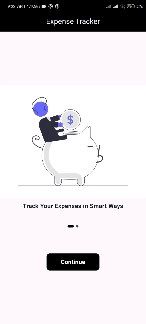

# Expense Tracking App

Expense Tracking App is a Flutter application designed to help users manage their expenses and keep track of their financial activities.

## Features

- Track income and expenses
- Add and manage accounts
- Add and categorize expenses
- View expense statistics with a pie chart
- Set reminders for upcoming expenses

## Demo

    

